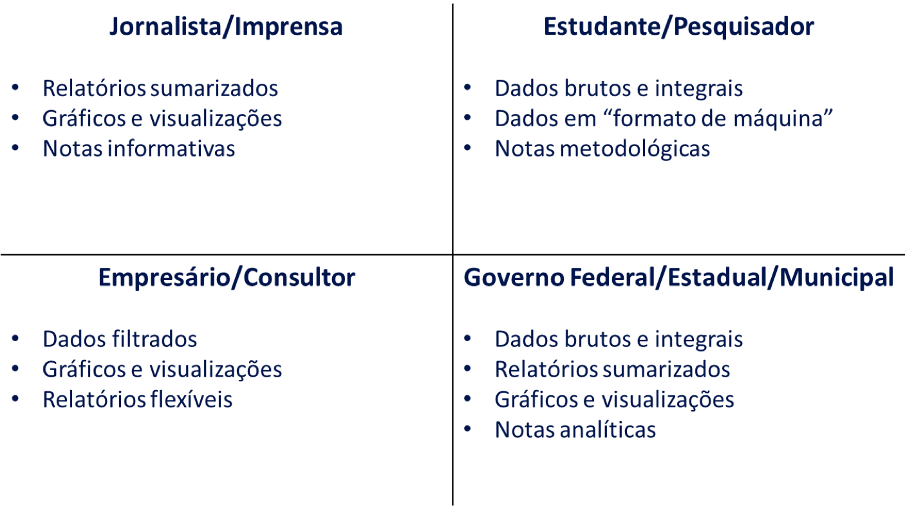

```{r setup, include=FALSE}
knitr::opts_chunk$set(echo = TRUE)
```

## Roteiro

- O que é o DEAEX?
- Histórico
- Adoção do R
- ComexVis
- Desafios
- Detalhes do projeto
- Demonstração


# Sobre o DEAEX {data-background=#000000}

## O que é o DEAEX

- **Departamento de Estatística e Apoio à Exportação**
    - Secretaria de Comércio Exterior (SECEX/MDIC)
- DECRETO Nº 8.663, DE 3 DE FEVEREIRO DE 2016 (Art. 21)
    - _VII - coletar, analisar, sistematizar e disseminar dados e informações estatísticas de comércio exterior e elaborar e divulgar a balança comercial brasileira (...);_
    - _VIII - elaborar estudos, indicadores, publicações e informações sobre produtos, setores e mercados estratégicos para o comércio exterior brasileiro;_


## O que é o DEAEX

- Produtos e análises para grande público alvo:




## Histórico

- Trabalho intensivo em tratamento, manipulação, análise e divulgação de dados
- Até 2015:
	- Processos manuais 
	- Plataformas diversas: SQL, Excel, Access, Macros (VB)
- Após 2015:
	- Automações
	- Plataforma padrão: SQL + R

## Adoção do R

- Aumento de demandas
- Cobrança por menor tempo de resposta
- Análises mais aprofundadas
- Renovação nos membros da equipe
- Redesenhos de processos
- Falta de orçamento

Solução: adotar R

- Gratuito, fácil aprendizado, versátil e poderoso

## Adoção do R

- Um membro da equipe conhecia R e começou a desbravar
- Pequenas provas de conceito foram surgindo e funcionando
- Outros membros foram aprendendo se ajudando
- Rapidamente os chefes perceberam resultados positivos e apoiaram uso do R
- Possibilidades de projetos de baixo custo com equipe própria (sem terceirização)
    - Exemplo: ComexVis

# ComexVis {data-background=#000000}

## ComexVis

- Representações gráficas e interativas dos dados de comércio exterior brasileiro
- Objetivo:
	- Auxiliar na análise e comunicação dos dados de comércio exterior
	- Exploração rápida sem precisar de ferramentas complexas
	- Uso simples
- Desenvolvido com R pelo DEAEX
- Duração de aproximadamente 3 meses
- Lançamento em julho/2016

## Desafios

- Os membros da equipe ainda estavam aprendendo R
- Sem recursos para capacitar adequadamente a equipe
- Sem envolvimento de um departamento de TI
- Necessidade de muito comprometimento da equipe

Soluções:

- Projeto desenvolvido de forma incremental (módulo a módulo)
- Primeiro módulo serviu como exemplo e documentação
- Cada membro comprometido com um módulo diferente
- Disseminação e compartilhamento total das informações

## Detalhes do projeto

- Optamos por "simular um sistema"
    - Não tinhamos um servidor de aplicação
    - Equipe sem background em TI
    - Sem suporte de equipe de desenvolvimento
- Todos as páginas são previamente geradas como relatórios (RMarkdown) e publicadas estaticamente em um FTP do MDIC

## Detalhes do projeto


# Demonstração {data-background=#000000}

## Link

- Infelizmente ainda não conseguimos um link próprio mais apropriado
- Acesso: www.mdic.gov.br > Comércio Exterior > Estatísticas de Comércio Exterior > Comex Vis

<h8><http://www.mdic.gov.br/index.php/comercio-exterior/estatisticas-de-comercio-exterior/comex-vis><h8>

# Obrigado {data-background=#000000}

## Contato

saulo.castro@mdic.gov.br

deaex.coest@mdic.gov.br

